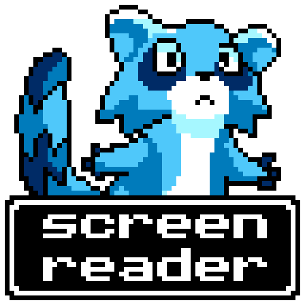

# godot-screenreader

A native screenreader for Godot 4.3+ games.

Inspired by the work of [LightsOutGames](https://github.com/lightsoutgames/godot-accessibility), who created the first Godot accessibility plugin for Godot 3.x, and [rodolpheh](https://github.com/rodolpheh/godot-accessibility), who converted LightsOutGames' plugin to be used for Godot 4.x.

For now, it is something that can be used to attach to your game to make menus and other features more accessible. However, I hope to include this screenreader in a plugin in the future as well to make the Editor more accessible.

## Extra Information

If you want to know more about the screenreader, you can view the following:
- [Player's Guide](/docs/1.0/playerguide.md)
- [Documentation](/docs/1.0/index.md)
- [Class Reference](/docs/1.0/classes.md)
- [Script Reference](/docs/1.0/scripts_info.md)
- [Credits](CREDITS.md)
- [License - MIT](LICENSE)
